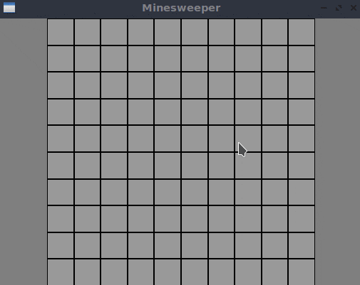
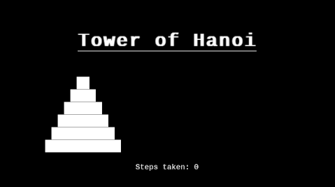

# cppgraphics

cppgraphics is a simple **C++11 library that provides 2D graphical output** through straightforward procedural calls. **Mouse and keyboard input** are also accessible. The library allows to draw graphics and react to input without having to know about OOP, resource management, GUI loop, event queue, etc. The programmer only needs to be familiar with `bool`, `int`, `double` and `std::string` data types. The library is a wrapper around SDL2, which is the only dependency.

Building an application with cppgraphics is simple, example projects and helper scripts are bundled. The process is completely automated for [MS Visual Studio Code](https://code.visualstudio.com/). See [docs/How_to_build.md](docs/How_to_build.md) for details.

The library works on **Windows, macOS, Linux and Emscripten**. There should be no major obstacles to make an iOS or Android builds with some tweaking.

## Examples

See two simple projects made using the library (both under 200 lines of code):

For more examples, see [this video](https://youtu.be/6EFNZGWxNro).

## What is it good for?
The library reduces boilerplate needed to get a simple GUI window running. This is useful for smaller projects where people just want to draw their stuff and not worry about keeping the window alive and propagating some state to and from the window. If you want to draw a circle, you call `cg::circle` and forget about it.

The library might also lower the bar for beginners and allow them to show graphics in C++ applications without having to learn much C++ first. I believe using this library is better than to copy-pasting some GUI code from the internet, bend it by trial and error and then ask questions about why it does not compile or work. While it is possible to just stick to console I/O, it is not fun and many beginner-grade projects contain things which make sense to visualize:

## How to use

A "Hello world" app looks like this (all platforms):

    #include "cppgraphics.hpp"
    int main()
    {
        cg::create_window("HELLO WORLD", 200., 200.);
        cg::circle(100., 100., 50.);
        cg::wait_until_closed();
        return 0;
    }

The header `include/cppgraphics.hpp` contains all necessary information about using the library. The most important rule is to never call any blocking functions other than ones provided by the library, otherwise the window won't respond. For more details, see [docs/Introduction.md](docs/Introduction.md). For build instructions, see [docs/How_to_build.md](docs/How_to_build.md).

## What is it **NOT** good for?
cppgraphics is designed to be as **simple to use** as possible, not to give top performance, flexibility or feature-completeness. It is not a UI library like [FLTK](https://www.fltk.org/) or [Dear ImGui](https://github.com/ocornut/imgui). It is not designed for game development like [SFML](https://www.sfml-dev.org/) or [SDL](https://www.libsdl.org/). It will not provide the performace you would get if you used OpenGL yourself. It is not meant to be used for bigger and serious projects and I do not plan to extend it in that direction. There are good and advanced libraries designed for such tasks already.

## Acknowledgment
cppgraphics is a wrapper around SDL2 and heavily relies on other libraries. Thanks to all authors and contributors of
- [SDL2](https://www.libsdl.org/) (external dependency)
- [GLAD](https://github.com/Dav1dde/glad) (used to generate OpenGL loader code)
- [stb_image](https://github.com/nothings/stb) (embedded in the source code)
- [stb_truetype](https://github.com/nothings/stb) (embedded in the source code)

The default font embedded in the source code is [Hack](https://github.com/source-foundry/Hack), the functions used to decode and encode it are taken from [Dear ImGui](https://github.com/ocornut/imgui). SDL2 downloading using CMake is based on deps handling in [PrusaSlicer](https://github.com/prusa3d/PrusaSlicer).

## Notes

cppgraphics source can be found at [GitHub](https://github.com/lukasmatena/cppgraphics).
Issues can be reported in [the GitHub issue tracker](https://github.com/lukasmatena/cppgraphics/issues).
Pull requests are possible, but anything apart from minor bugfixes is unlikely to be merged.
