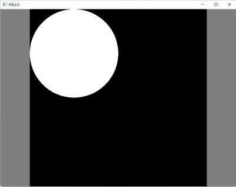

# What you should know when using cppgraphics

Most information can be gathered from reading comments in cppgraphics.hpp. There are just several things that might need a more thorough description.

### Window, coordinate system

When you create a window using `cg::create_window`, you can pass its width and height. This creates a window of the given size and also defines its internal coordinate system which is used for the drawing functions. When the user resizes the window, the drawable area of the window retains its aspect ratio and you can still address it using the same coordinate system (the coordinates do not have to correspond to actual pixels). The rest of the window is filled with neutral color (adjustable with `set_inactive_color`). This means that whatever you draw is not distorted after the resize and you can use the same coordinate system the whole time, without paying attention about whether the window was resized, maximized, etc.

In other words, creating the window using `cg::create_window("HELLO", 400, 400)` means that your drawable canvas will always be a square (0,0)-(400,400), no matter what you or the user do to the window later. You can misuse this to change the coordinate system to your needs. For example:

    cg::create_window("HELLO", 1., 1.);  // create a very small window and set coordinate system to unit square
    cg::set_window_size(800, 600);       // immediately resize the window to something meaningful
    cg::circle(0.25, 0.25, 0.25);        // circle in the top-left quadrant
    cg::wait_until_closed();

will produce this:

### Keeping the window alive

cppgraphics does not use any macro magic or multithreading to create an illusion that there is no GUI loop. Your `main()` function is the actual main function and your application runs in a single thread. If you are doing something, you must either call `cg::refresh` every now and then or let the application hang on `cg::wait` or `cg::wait_until_...` function.

That is, you cannot use `std::cin` (use `cg::read_line` instead), you cannot wait using `std::this_thread::sleep_for` (use `cg::wait`), etc.

How it works internally: whenever you call any of these "refreshing" functions, cppgraphics collects all events from the operating system (mouse moved, window closed, etc.), sleeps for a while to not load the CPU too much, redraws the window when needed and returns when it is time to do so, giving control back to you. When you "draw" something, it is just added into a list of things that you want on screen, and it will render next time.

Regarding the "returns when it is time to do so": When you call `cg::refresh` in an infinite loop, cppgraphics tries to do the timing so the loop runs 50 times per second (by default). Default FPS is 25, so the graphics is rendered every 40 ms. Therefore, the following code

    int a = 0;
    while (cg::refresh()) {
        cg::clear();
        ++a;
        std::cout << a << "\t" << cg::time_since_start()
                  << "\t"      << cg::get_measured_fps()
                  << std::endl;
    }

will increment `a` by 50 every second and render 25 frames during that time. If the `cg::refresh` call was missing, the window would freeze. Note that on average every other `cg::circle` call is needless, because that circle will be cleared before it has time to render. This is because the default value for FPS is purposefully set low. The timing is adjustable using the `cg::set_fps` and `cg::set_steps_per_second`, but there should be little need to do it for simple projects that cppgraphics is meant for.

Note that the timing cannot be completely relied upon, especially when you render so much stuff that the CPU does not keep up.

### Checking that the window lives

When you close your window, you may sometimes notice weird console message about non-existing window. For example

    cg::create_window();
    while (cg::is_window_open()) {
        cg::refresh();
        cg::clear();
        cg::circle(cg::get_mouse_x(), cg::get_mouse_y(), 20.);
    }
    
creates a nice window with a circle following mouse cursor. When you close the window, it will report: "cppgraphics:  function cg::clear called without an active window. The application exits.". What happens is that the closing of the window is handled during the `cg::refresh`, which closes the window and returns. Your code then calls `cg::clear`, but the window is already dead. Most cppgraphics functions just report this as an error, report it on `std::cerr` and `std::terminate` you application . The solution (if you care, which you don't have to) is to move the `cg::refresh` to the end of the loop. That way the first function that you call after the window is closed is `cg::is_window_open`, which will return `false` and break the loop. (You can also rewrite the while condition to `while (cg::refresh)` and skip the `cg::refresh` call in the loop, because `cg::refresh` returns false when the window was closed.)

In short, whenever you call `wait_until_keypressed` etc., there is no guarantee that the window will still be alive when the function returns. If you need to know, check the return value for `cg::WindowClosed` or check separately using `cg::is_window_open`. Otherwise, next cppgraphics call will probably terminate your application.

### How slow is it?

The way cppgraphics uses OpenGL is far from optimal, every clear means that all the objects have to be created again and sent to the GPU, even if they are the same as they were before. Images and fonts are handled slightly more cleverly, they are converted to textures which live on the GPU longer. Drawing the same image over and over should be as CPU demanding as if it was just a rectangle. In general, it is much faster than you should need for simple 2D graphics. The OpenGL pipeline is designed to handle millions of triangles, but the 2D graphics will usually use thousands at most.

If a large part of your scene is static, you may consider using "batches", which will improve performance by not having to regenerate the static vertices in each frame. There is an example in `examples/performance` showing the difference. However, if you end up having to do it, you should also think about what are you doing and if cppgraphics is still the right tool.

Also, profile. If you render simple 2D graphics and your application is slow, chances are that the problem is your algorithm, not the rendering.

### Where are collision detection algorithms, physics engines and such things?

They are not here and they never will be. cppgraphics is an educational tool, not a game library. Simplicity is preferred to feature completeness.
