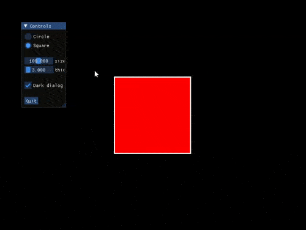

This is a demonstration of how to use Dear ImGui library in projects based on
cppgraphics library. [Dear ImGui](https://github.com/ocornut/imgui) is a simple
and efficient tool to create UI in a continuously redrawn OpenGL scene:

In order to build a cppgraphics project with ImGui support, you need to
do the same as with any other cppgraphics project plus the following:

- Dear ImGui sources must be included in the project
- Two extra ImGui files (`imgui_impl_sdl.cpp` and `imgui_impl_opengl3.cpp`)
    must be included in the project. Both are located in `backends/` folder.
- Dear ImGui headers must be accessible, including its `backends/` folder
- `CPPGRAPHICS_SUPPORT_IMGUI` preprocessor macro must be defined

The easiest way of doing all that is to copy CMakeLists.txt from
`projects/000_template_xxx` template project into this directory.
Then you can build it like this (run it in `examples/imgui`):

    git clone https://github.com/ocornut/imgui
    mkdir build
    cd build
    cmake .. -DCMAKE_PREFIX_PATH="%cd%/../../../deps/build/destdir/usr/local" -DCPPGRAPHICS_IMGUI_PATH="%cd%/../imgui"
    cmake --build . --config Release

(Use `$(pwd)` on Linux/macOS instead of `%cd%`.) The CMake script will build
SDL2 (which is a dependency of cppgraphics), and then the project including
all sources from cppgraphics and Dear ImGui.

IMPORTANT: Note that the Dear ImGui support comes at a price. You cannot use any
of the following functions: `cg::wait`, `cg::wait_until_keypressed`,
`cg::wait_until_mouse`, `cg::wait_until_input`, `cg::read_line`. Also, ImGui windows will
always be rendered on top of what you draw using cppgraphics.

